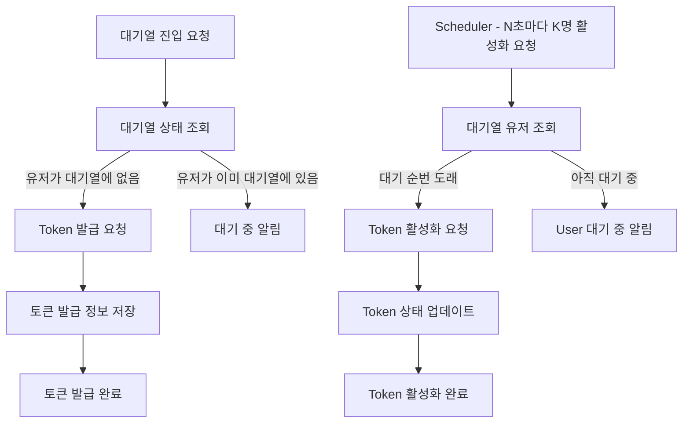
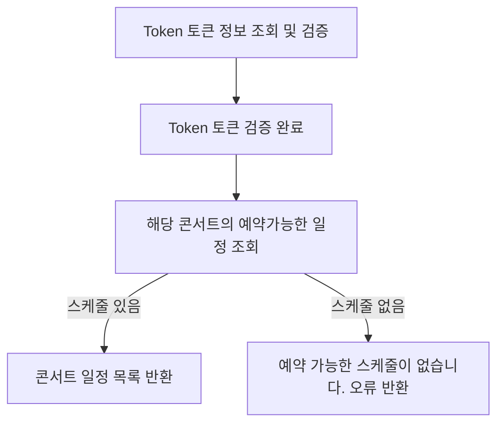
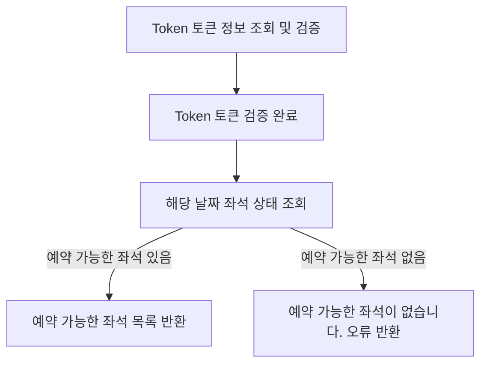
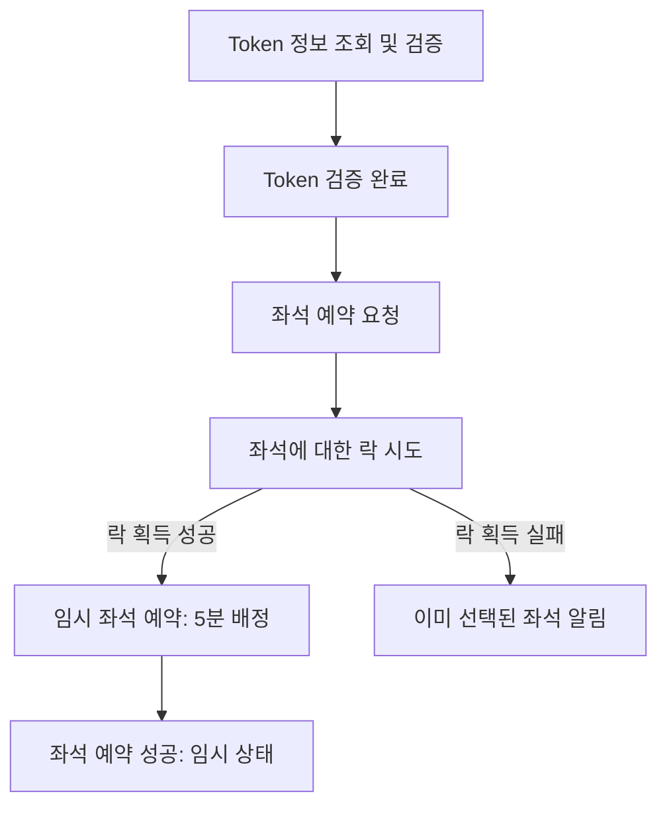
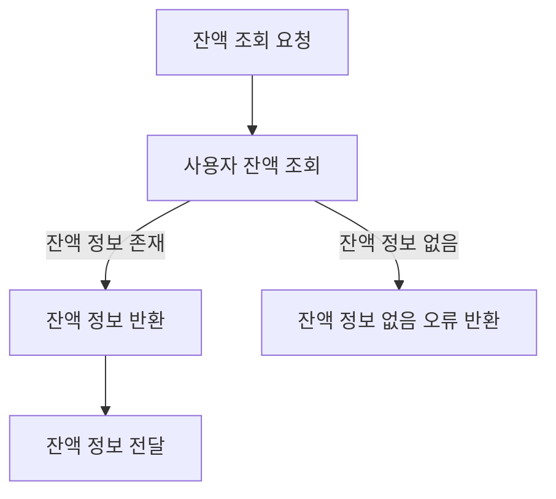
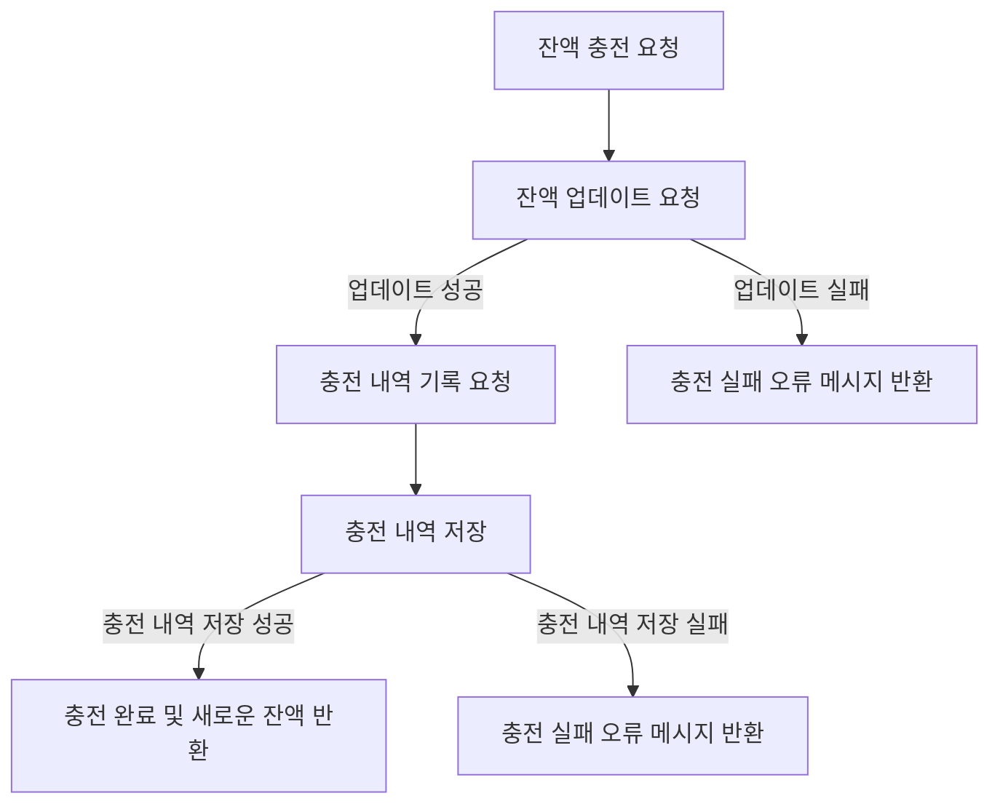
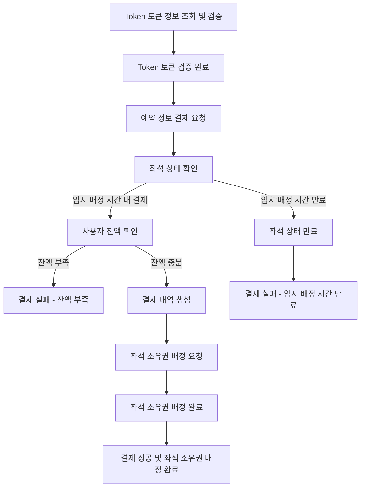

### 1. 유저 대기열 토큰 발급 및 대기열 상태 조회,토큰 활성화

```mermaid
graph TD
    A[대기열 진입 요청] --> B[대기열 상태 조회]
    B -->|유저가 대기열에 없음| C[Token 발급 요청]
    C --> D[토큰 발급 정보 저장]
    D --> E[토큰 발급 완료]
    B -->|유저가 이미 대기열에 있음| F[대기 중 알림]
    J[Scheduler - N초마다 K명 활성화 요청] --> K[ 대기열 유저 조회]
    K -->|대기 순번 도래| L[Token 활성화 요청]
    L --> M[Token 상태 업데이트]
    M --> N[Token 활성화 완료]
    K -->|아직 대기 중| P[User 대기 중 알림]
```
### 2. 콘서트의 예약가능 날짜 조회

```mermaid
graph TD
    A[Token 토큰 정보 조회 및 검증]
    A --> B[Token 토큰 검증 완료]
    B --> D[해당 콘서트의 예약가능한 일정 조회]
    D -->|스케줄 있음| F[콘서트 일정 목록 반환]
    D -->|스케줄 없음| G["예약 가능한 스케줄이 없습니다." 오류 반환]
```

### 3. 선택한 날짜의 좌석 조회

```mermaid
graph TD
    A[Token 토큰 정보 조회 및 검증]
    A --> B[Token 토큰 검증 완료]
    B --> D[해당 날짜 좌석 상태 조회 ]
    D -->|예약 가능한 좌석 있음| F[예약 가능한 좌석 목록 반환]
    D -->|예약 가능한 좌석 없음| G["예약 가능한 좌석이 없습니다." 오류 반환]
```

### 4. 좌석 예약 요청 API

```mermaid
graph TD
    A[Token 정보 조회 및 검증] --> B[Token 검증 완료]
    B --> C[좌석 예약 요청]
    C --> D[좌석에 대한 락 시도]
    D -->|락 획득 성공| E[임시 좌석 예약: 5분 배정]
    E --> F[좌석 예약 성공: 임시 상태]
    D -->|락 획득 실패| G[이미 선택된 좌석 알림]
```

### 5. 잔액 조회

```mermaid
graph TD
    A[잔액 조회 요청] --> B[사용자 잔액 조회]
    B -->|잔액 정보 존재| C[잔액 정보 반환]
    C --> D[잔액 정보 전달]
    B -->|잔액 정보 없음| E[잔액 정보 없음 오류 반환]
```

### 6. 잔액 충전

```mermaid
graph TD
    A[ 잔액 충전 요청] --> B[ 잔액 업데이트 요청]
    B -->|업데이트 성공| C[ 충전 내역 기록 요청]
    C --> D[ 충전 내역 저장]
    D -->|충전 내역 저장 성공| E[ 충전 완료 및 새로운 잔액 반환]
    B -->|업데이트 실패| F[충전 실패 오류 메시지 반환]
    D -->|충전 내역 저장 실패| G[ 충전 실패 오류 메시지 반환]
```

### 7.예약 내역 결제

```mermaid
graph TD
    A[Token 토큰 정보 조회 및 검증]
    A --> B[Token 토큰 검증 완료]
    B --> C[예약 정보 결제 요청]
    C --> D[좌석 상태 확인]

    D -->|임시 배정 시간 내 결제| E[사용자 잔액 확인]
    E -->|잔액 부족| F[결제 실패 - 잔액 부족]
    E -->|잔액 충분| G[결제 내역 생성]
    G --> H[좌석 소유권 배정 요청]
    H --> I[좌석 소유권 배정 완료]
    I --> J[결제 성공 및 좌석 소유권 배정 완료]

    D -->|임시 배정 시간 만료| K[좌석 상태 만료]
    K --> L[결제 실패 - 임시 배정 시간 만료]
```
