# 쿼리 성능 개선 보고서

## 조회 쿼리 수집
- WaitingQueue
    - Redis로 완전히 이관하여  RDBMS 로직 없음
- Concert
    - 콘서트 목록 조회 - 현재 예약 가능한 콘서트 목록 조회
- Schedule
    - 선택 콘서트의 일정 조회
- Seat
    - 예약가능 좌석 조회
    - 선택한 좌석 조회 (예약 가능 여부)
    - 만료된 좌석 조회 (만료된 UNAVAILBLE한 좌석 찾아서 AVAILABLE로 바꿔줌(스케쥴러))
- Reservation
    - 예약조회
- Point
    - 현재 포인트 조회

# 개선이 필요하지 않는 쿼리들
PK와 FK는 MySQL에서 자동으로 인덱스를 생성하며, 이 인덱스들은 쿼리 성능 최적화에 중요한 역할을 한다. PK는 클러스터형 인덱스로 테이블의 기본 키 컬럼에 대해 데이터가 물리적으로 정렬되어 저장되며, 이를 통해 빠른 조회와 검색이 가능하다. 
FK는 비클러스터형 인덱스로 부모 테이블과 자식 테이블 간의 관계를 관리하고, 외래 키 컬럼에 대한 빠른 검색을 지원한다. 이러한 인덱스들은 EXPLAIN에서 잘 활용되고 있다면 성능을 크게 향상시키며, 추가적인 인덱스 설정 없이도 충분히 최적화된 상태를 유지할 수 있다.


### Schedule - 콘서트 스케쥴 조회
- 쿼리 실행 시간<br/>
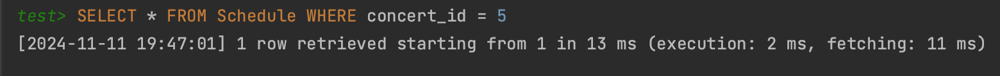<br/>
- 쿼리 실행 계획<br/>
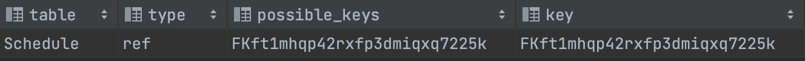<br/>
- 인덱스 설정<br/>
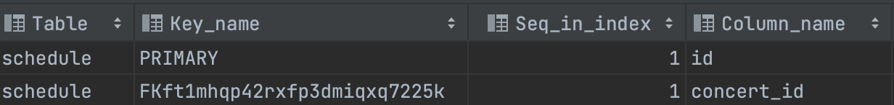<br/>

  
### Seat - 예약가능 좌석 조회
- 쿼리 실행 시간<br/>
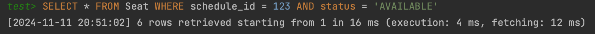<br/>
- 쿼리 실행 계획<br/>
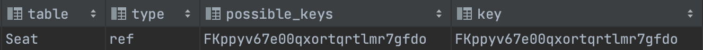<br/>
- 인덱스 설정<br/>
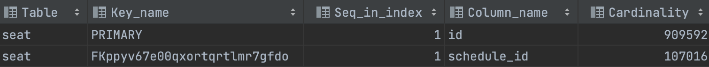<br/>


### Seat - 선택한 좌석 조회
- 쿼리 실행 시간<br/>
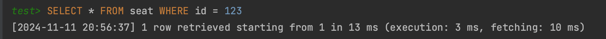<br/>
- 쿼리 실행 계획<br/>
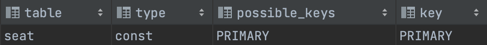<br/>

### Reservation - 예약 조회
- 쿼리 실행 시간 <br/>
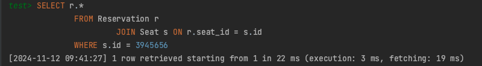 <br/>
- 쿼리 실행 계획 <br/>
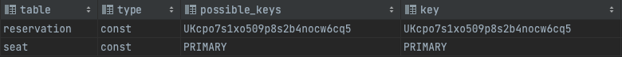 <br/>
- 인덱스 설정<br/>
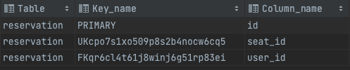

앞선 쿼리들의 쿼리 실행시간과 쿼리 실행계획 결과를 보면 인덱스를 잘 타고있으며 실행시간도 매우 짧다. 이미 성능 최적화가 되어있어 추가적인 작업은 필요없다 판단하였다.

# 개선이 필요한 쿼리

### Concert - 진행중인 콘서트 목록 조회
#### 개선 전
- 쿼리 실행 시간<br/>
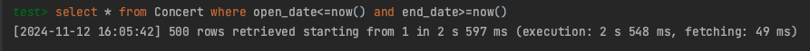<br/>
- 쿼리 실행 계획 <br/>
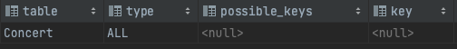<br/>

쿼리 실행 시간이 2초 이상 소요되었으며, 실행 계획을 보면 테이블 풀 스캔이 발생하고있다. 
이 경우, 전체 데이터에 대해 검색을 수행하게 되어 데이터가 많아지면 성능 문제가 발생한다.

#### 개선 후
복합 인덱스는 순서가 매우 중요하다. 먼저 open_date를 첫 번째 컬럼으로 설정하여 인덱스를 최적화했다.
```
CREATE INDEX idx_concert_dates ON Concert(open_date,end_date);
```
- 쿼리 실행 시간<br/>
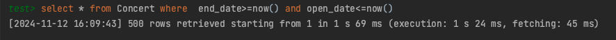<br/>
- 쿼리 실행 계획<br/>
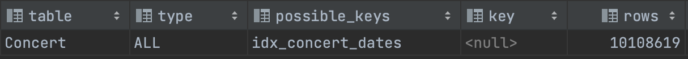<br/>

인덱스를 적용한 후, 약 59.81% 성능 개선이 이루어졌으나, 실행 계획을 보면 옵티마이저가 풀스캔을 더 유리하게 판단하고 있다. 
서비스가 지속됨에 따라 open_date가 NOW()보다 이전인 데이터는 계속 증가할 것이다. 결국, 데이터가 많아지면 풀스캔을 하는 것과 성능 차이가 거의 없어질 가능성이 있다.
### 인덱스 순서 바꿔서

```
CREATE INDEX idx_concert_dates ON Concert(end_date,open_date);
```
- 쿼리 실행 시간<br/>
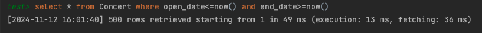<br/>

- 쿼리 실행 계획<br/>
<br/>

**end_date**를 첫 번째 컬럼으로 설정하여 현재 진행 중인 또는 진행 예정인 콘서트를 먼저 조회할 수 있게 하였다.
이를 통해 반환되는 행의 수를 줄이고, 인덱스를 효율적으로 활용할 수 있었다.
실제로, open_date를 첫 번째 컬럼으로 했을 때보다 실행 시간이 크게 감소했으며, 인덱스도 잘 활용되는 것을 확인할 수 있었다.<br/>
쿼리 실행 계획은 100% 신뢰할 수 없으며 데이터의 개수와 분포에 따라 여전히 풀 스캔이 발생할 수 있다.
그러나 풀스캔이 일어나더라도 사용자 경험에는 큰 영향을 미치지 않을 것으로 예상된다. 데이터가 천만 건에 이를 것이라고 예상되지는 않으며
콘서트 목록 조회는 Redis에서 별도로 캐싱하고 있기 때문에 성능에 미치는 영향이 제한적일 것이라 판단된다.
  
### Seat - 만료 좌석 조회
#### 개선 전
- 쿼리 실행 시간<br/>
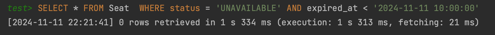<br/>
- 쿼리 실행 계획<br/>
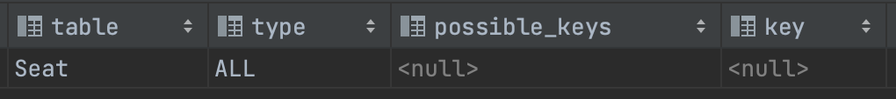<br/>

좌석이 만료 시간이 지나기 전까지 결제가 완료되지 않으면 해당 좌석을 다시 사용 가능하도록 변경하는 작업을 위해 만료된 좌석을 조회하는 쿼리가 필요하다. 
테이블을 풀스캔하여 만료된 좌석을 찾는 것은 성능에 매우 비효율적이기 때문에, status와 expired_at 컬럼에 대한 복합 인덱스를 설정하여 성능을 개선하였다. 복합 인덱스를 사용하면 status = 'UNAVAILABLE' 조건과 범위 검색을 위한 expired_at 조건을 동시에 효율적으로 처리할 수 있다. 이 방식은 만료된 좌석을 빠르게 조회하고, 스케줄러 작업을 보다 효율적으로 처리할 수 있도록 도와준다.
```
CREATE INDEX idx_seat_status_expiredAt ON Seat(status, expired_at);
```

#### 개선 후 
- 쿼리 실행 시간<br/>
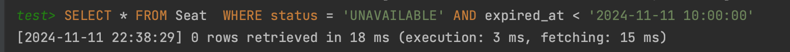<br/>
- 쿼리 실행 계획<br/>
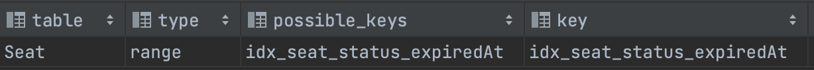<br/>

쿼리 실행 시간이 대폭 감소하고 인덱스를 잘 타고있는것을 확인 할 수 있다.


### Point - 포인트조회
#### 개선 전
- 쿼리 실행 시간<br/>
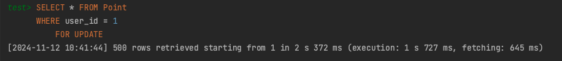<br/>
- 쿼리 실행 계획<br/>
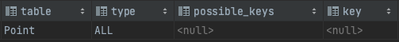<br/>

Point 테이블과 User 테이블은 연관 관계가 있어야 하지만, FK 제약을 사용하지 않고 어플리케이션 레벨에서 관계를 관리했다. 이로 인해, 외래 키 인덱스가 자동으로 생성되지 않았고, 쿼리 성능이 저하되는 문제가 발생했다.
이를 해결하기 위해 Point 테이블에 user_id 컬럼에 인덱스를 추가하여 성능을 개선했다. 인덱스를 추가한 후, SELECT 쿼리에서 user_id를 조건으로 검색하는 작업이 인덱스를 활용하여 더욱 빠르게 처리되었다.
```
CREATE INDEX idx_user_id ON Point(user_id);
```
#### 개선 후
- 쿼리 실행 시간<br/>
<br/>
- 쿼리 실행 계획<br/>
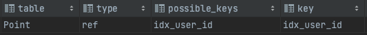<br/>

쿼리 실행 시간이 대폭 감소하고 인덱스를 잘 타고있는것을 확인 할 수 있다.

### 성능향상 요약표

| 목록 | 개선전(ms) | 개선후(ms) | 개선율(%) |
| --- | --- | --- | --- |
| 콘서트 목록 조회 | 2548 | 13 | 99.49 |
| 만료좌석 조회 | 1313 | 3 | 99.77 |
| 포인트 조회 | 1727 | 4 | 99.77 |


