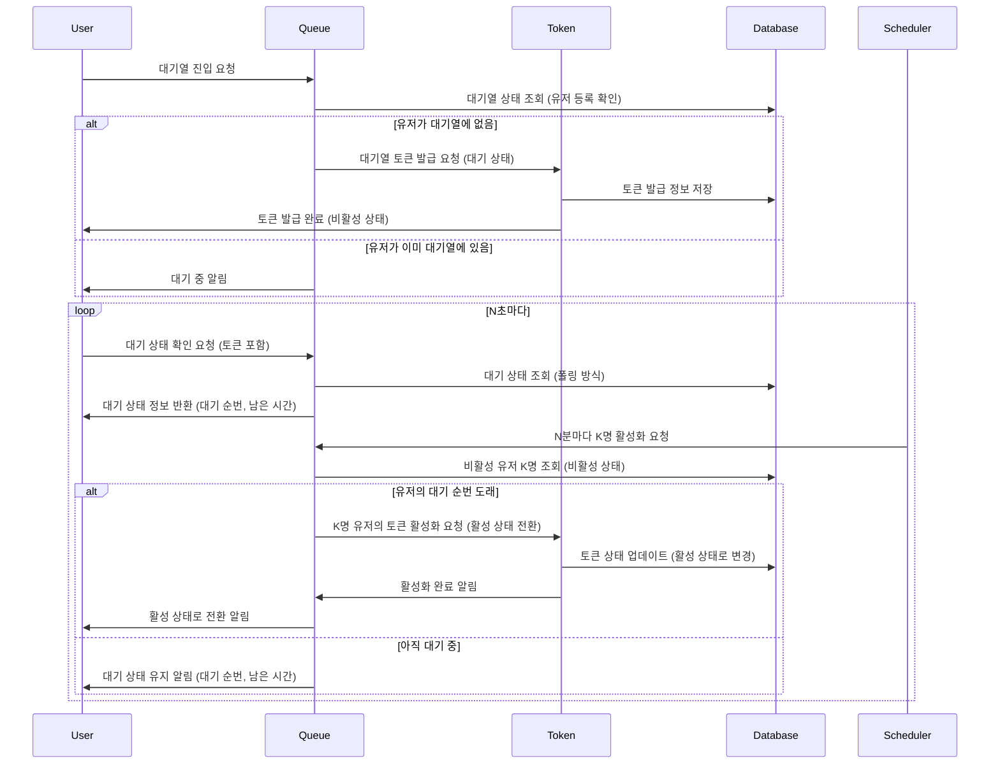
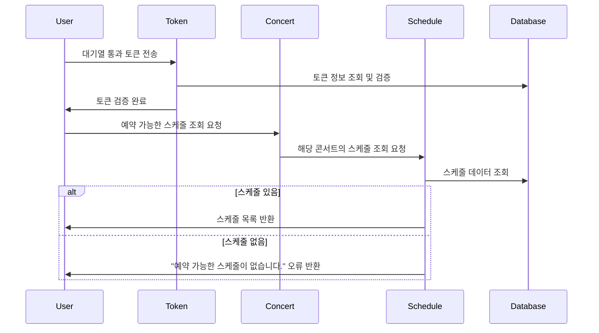
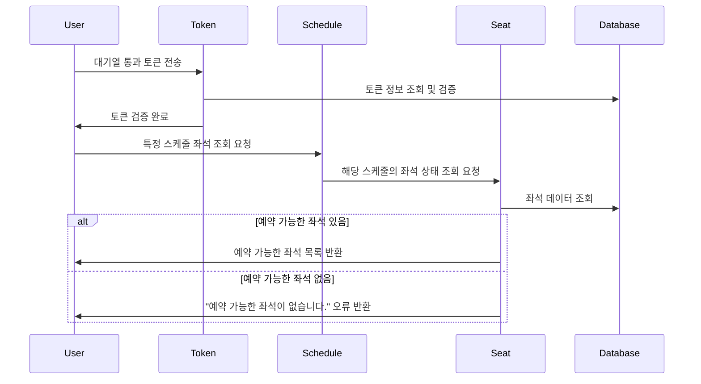
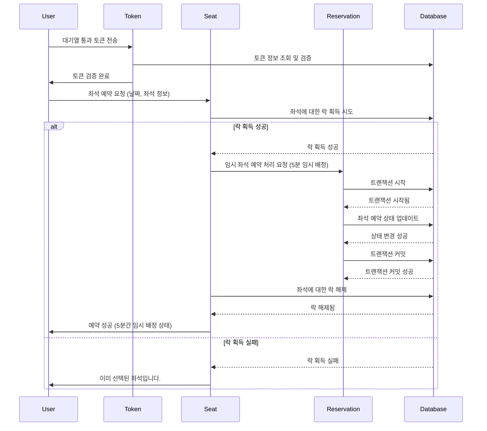
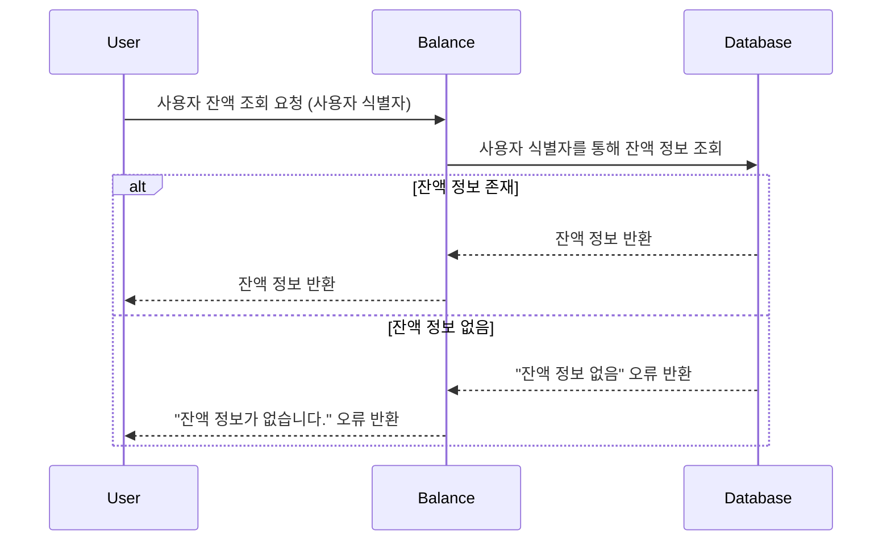
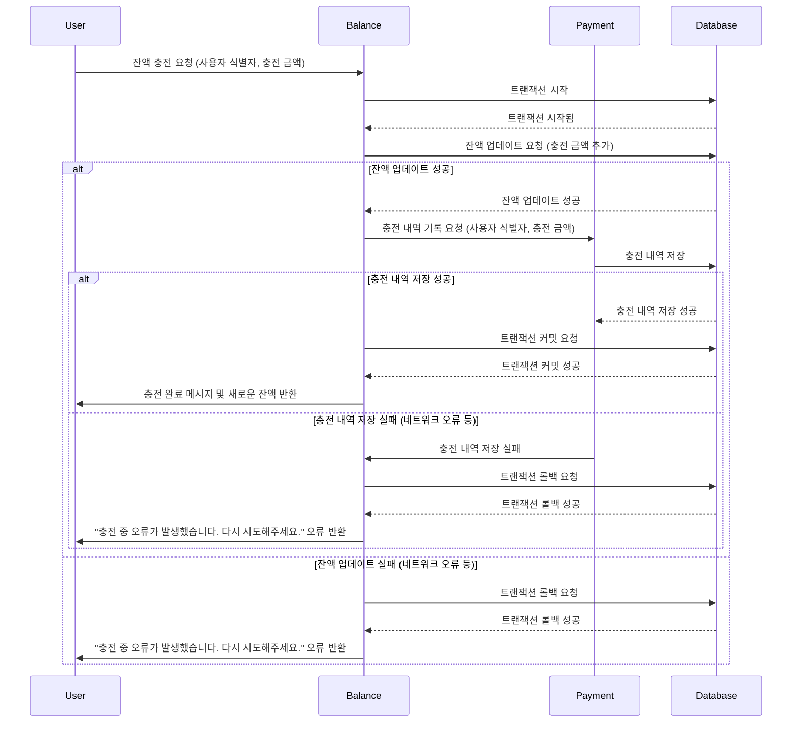
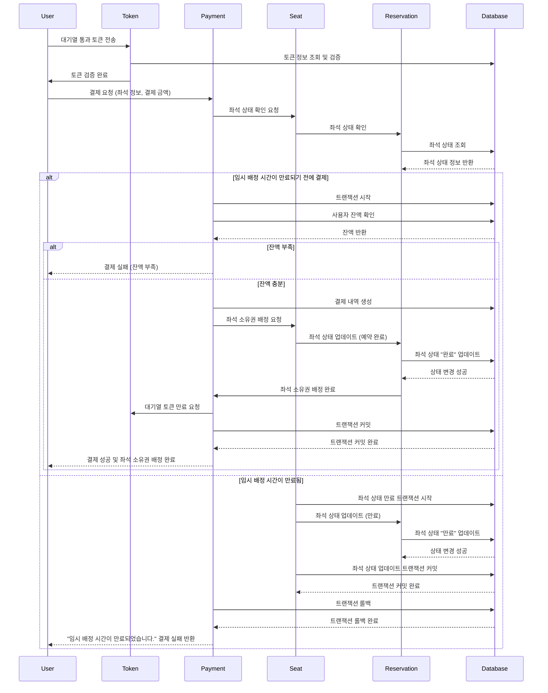

### 1. 유저 대기열 토큰 발급 및 검증
- N초마다 K명씩 토큰을 비활성 -> 활성으로 전환
- 콘서트마다 큐 엔트리 생성

### 2. 콘서트의 예약가능 날짜 조회

### 3. 선택한 날짜의 좌석 조회

### 4. 좌석 예약 요청 API

### 5. 잔액 조회 
- 잔액조회는 대기열을 거처야만 할 수 있는것이 아니기 떄문에 토큰검증을 하지않음

### 6. 잔액 충전
- 잔액충전은 대기열을 거쳐야만 할 수 있는것이 아니기 떄문에 토큰 검증을 하지않음

### 7. 결제 API
- 결제 요청을 처리하기 전에 대기열 검증을 통과해야 하고, 결제가 성공하면 토큰을 만료시킴.
